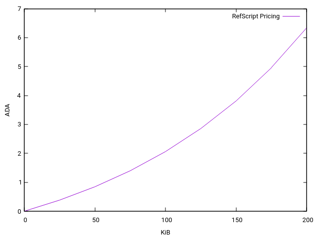

## Status

Accepted

## Context

It was identified a while ago that there is an overhead associated with deserializing scripts, so much so that it would be possible to create a very large script that was fairly expensive to deserialize, but very cheap to execute. This opened up an attack vector when such a Plutus script would be used as a reference script. This problem was exacerbated by the fact that there was no real limit on the total size of reference scripts that could be used in a transaction, thus being limited only by the size of the transaction itself. Therefore this opened up Cardano to a DDoS attack where an attacker could submit many such transactions that would cost very little, but would be expensive for a `cardano-node` to validate.

In order to prevent such an attack a `"minFeeRefScriptCostPerByte"` protocol parameter was introduced in the Conway era. The idea was fairly simple: we would calculate the total size of reference scripts used by a transaction and multiply it by the value specified by this protocol parameter. Result would be added to the transaction fee. However, in order for this approach to be a definite deterrent of such attacks this parameter would have to be set to a fairly high value. Community was not very keen on having this value set to a high enough value, since that could make reference scripts almost as expensive to use as regular scripts, thus significantly reducing their usability. Taking this fact into consideration, a decision was made to set this parameter to a fairly moderate value to at least deter potential attacks like that by at least making it pretty expensive, instead of prohibitively expensive. This would allow us to fine tune the parameter or potentially change the pricing algorithm at a later point after we were already in the Conway era. This reasoning was coming from the fact that at that point we would be able to reveal to a wider audience the true nature of this issue.

Unfortunately things did not go exactly as planned, because on [June 25th 2024 an attack like this actually took place](https://cardanospot.io/news/ddos-attack-on-the-cardano-blockchain-mRIKAzZTNnzq5NGd). This attack forced us to make a quick decision on implementing a definite prevention of such attacks, while trying to not have a drastic impact on the common use case that DApp developers rely on so much.

## Decision

Linear pricing was either too expensive when the multiplier was set too high or was an inadequate deterrent when the multiplier was set too low. Therefore, we needed to implement a pricing mechanism that would be very expensive for usage with large quantities of large plutus scripts, while keeping the pricing reasonably low for the most common use case of a total size of reference scripts of at most 25KiB per transaction. One of the constraints we had to operate under was inability to add any new protocol parameters, since that was a bit too late in the release cycle of the Conway era. In other words we had to hard code some values, which will be turned into proper protocol parameters in the next era.

### Reference scripts total size

When compared to fee calculation of the Babbage era we only add this extra amount that depends on the reference scripts. At a high level it works in this way:

1. We combine all of the regular inputs and reference inputs from the transaction
2. Lookup the outputs from the UTxO map that correspond to those inputs
3. Calculate the size of every reference script in all of those outputs. Outputs that don't have a reference script do not affect this calculation
4. Sum all of the computed sizes.

Here are some important properties of this calculation:

* Any input that appears in both regular inputs and reference inputs of a transaction is only used once in this computation.
* Duplicate reference scripts that appear in any of the outputs are not removed for the purpose of the fee calculation and will contribute their size as many times as they appear.
* All Plutus scripts contribute to this calculation, regardless if they are being used or not within the transaction.
* Native scripts that are used as reference scripts also contribute their size to this calculation.

### Formula for the cost due to reference script usage

Once we have the total size of reference scripts used in a transaction we can proceed to computing the amount of Lovelace that will be added to the fee of a transaction. Instead of using the same linear cost for the whole size we split this total size into `25KiB` chunks and each subsequent chunk will get a linear pricing cost that is higher than the previous one by a multiplier of `1.2`. In other words pricing for the first `25KiB` will be as with the initial approach, just the value of `minFeeRefScriptCostPerByte`. The following `25KiB` will have the price of `minFeeRefScriptCostPerByte * multiplier` and  so on. These are the two new hardcoded values in the fee computation:

* Size increment: `25KiB` (or 25,600 bytes)
* Multiplier: `1.2`
* minFeeRefScriptCostPerByte: `15` (supplied in Conway genesis)

This tiered pricing for reference scripts is defined by this recursive function:

```haskell
tierRefScriptFee :: Integer -> Integer
tierRefScriptFee = go 0 minFeeRefScriptCostPerByte
  where
    go acc curTierPrice n
      | n < sizeIncrement =
          floor (acc + (n % 1) * curTierPrice)
      | otherwise =
          let acc' = acc + curTierPrice * (sizeIncrement % 1)
           in go acc' (multiplier * curTierPrice) (n - sizeIncrement)
    sizeIncrement = 25600
    multiplier = 1.2
    minFeeRefScriptCostPerByte = 15
```

The result of applying this function to the total reference script size used by a transaction will be the increase to the fee amount when compared to the fee calculation that was done in the Babbage era. Below is the plot with the cost in ADA for reference scripts used in a transaction per kilobyte for current parameters:




### Reference script size limit

In order to further increase the resilience to this sort of attacks we added hard limits on the total size of reference scripts that can be used per transaction and per block.

Hard caps that are currently hard coded, but will be turned into actual protocol parameters in the next era after Conway:

* Limit per transaction: `200KiB` (or `204800` bytes)
* Limit per block: `1MiB` (or `1048576` bytes)

## Consequences

Unlike previous eras, inclusion of any inputs in the transaction containing reference scripts is no longer free. Overhead of using reference scripts was not properly accounted for when this feature was introduced in the Babbage era, which is now fixed in the Conwya era.
